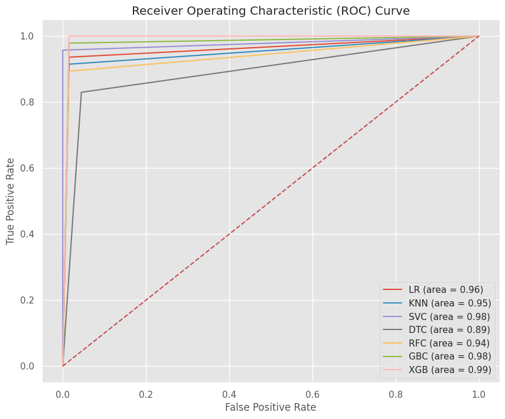

# Breast-Cancer-Classification

# Overview
This project aims to build and evaluate multiple machine learning models for the classification of breast cancer. Using a dataset of breast cancer instances, we implement and compare several classification algorithms to identify which model provides the best performance based on various metrics, including the Area Under the ROC Curve (AUC-ROC).

# Table of Contents
[Introduction](#introduction)

[Dataset](#dataset)

[Requirements](#requirements)

[Models Used](#models-used)

[Evaluation Metrics](#evaluation-metrics)

[Results](#results)

[Contributing](#contributing)

[License](#license)

# Introduction
Breast cancer is one of the most common cancers among women worldwide. Early detection and diagnosis are crucial for effective treatment and improving survival rates. This project explores the use of machine learning models to classify breast cancer instances as benign or malignant.

## Dataset
The dataset used in this project is the Breast Cancer Dataset from Kaggle. It contains 569 instances of breast cancer cases, each with 30 features.
## Features
* id                                         
* radius_mean                
* texture_mean               
* perimeter_mean            
* area_mean                  
* smoothness_mean            
* compactness_mean           
* concavity_mean            
* concave_points_mean        
* symmetry_mean              
* fractal_dimension_mean     
* texture_se                 
* perimeter_se               
* area_se                    
* smoothness_se              
* compactness_se             
* concavity_se               
* concave_points_se          
* symmetry_se                
* fractal_dimension_se       
* radius_worst               
* texture_worst              
* perimeter_worst            
* area_worst                 
* smoothness_worst           
* compactness_worst          
* concavity_worst            
* concave_points_worst       
* symmetry_worst             
* fractal_dimension_worst    
## Target
Diagnosis: Classification of the tumor ('M' for malignant, 'B' for benign)
## Requirements
The project is implemented in Python and requires the following libraries:

- numpy
- pandas
- scikit-learn
- matplotlib
- seaborn
- xgboost

## Models Used
The following machine learning models are implemented and compared in this project:

* Logistic Regression (LR)
* K-Nearest Neighbors (KNN)
* Support Vector Classifier (SVC)
* Decision Tree Classifier (DTC)
* Random Forest Classifier (RFC)
* Gradient Boosting Classifier (GBC)
* XGBoost Classifier (XGB)
## Evaluation Metrics
We evaluate the performance of each model using the following metrics:

* Accuracy
* confusion metrics
* classification report
* Area Under the ROC Curve (AUC-ROC)
* 

## Results
The models are evaluated on a test set, and the ROC curves are plotted for each model to visualize their performance. Below is an example of how to interpret the results:

* Logistic Regression: AUC = 0.96
* K-Nearest Neighbors: AUC = 0.95
* Support Vector Classifier: AUC = 0.98
* Decision Tree Classifier: AUC = 0.92
* Random Forest Classifier: AUC = 0.94
* Gradient Boosting Classifier: AUC = 0.98
* XGBoost Classifier: AUC = 0.99

## Contributing
Contributions are welcome! If you find any issues or have suggestions for improvements, please open an issue or create a pull request.

## License
This project is licensed under the MIT License. See the [LICENSE](https://github.com/ayshahaneena/Breast-Cancer-Classification/blob/main/LICENSE) file for details.
